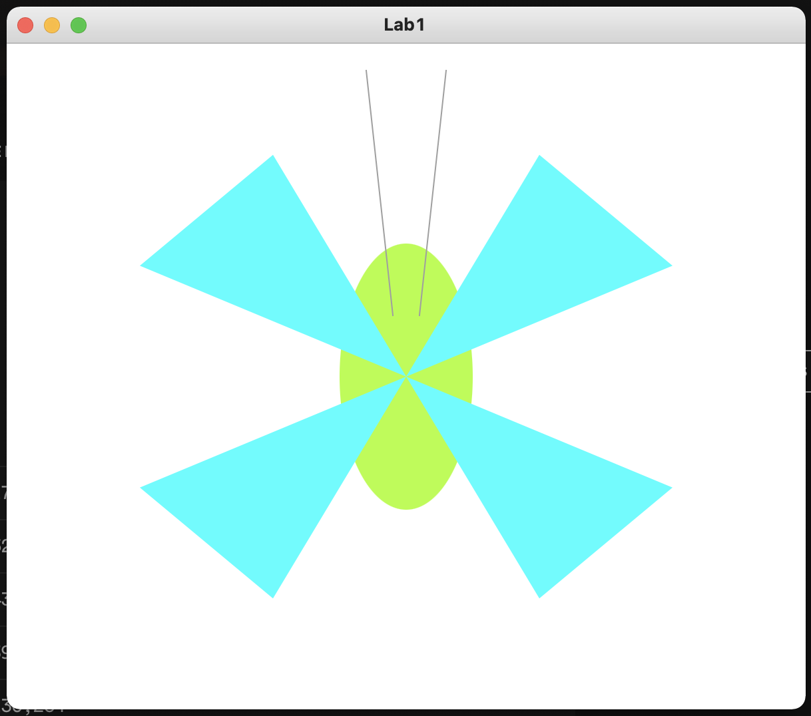

# Лаброторна робота №1 
## *Пашинник Андрій КП-81*

Варіант: **№15**

Результат:


Код программи:
```Java
package sample;

import javafx.application.Application;
import javafx.geometry.Point2D;
import javafx.scene.Group;
import javafx.scene.Scene;
import javafx.scene.paint.Color;
import javafx.stage.Stage;

import javafx.scene.shape.*;

public class Main extends Application {

    @Override
    public void start(Stage primaryStage) throws Exception{
        Group root = new Group();

        double SCENE_WIDTH = 600;
        double SCENE_HEIGHT = 500;

        Scene scene = new Scene(root, SCENE_WIDTH, SCENE_HEIGHT);

        // ************************************************************************
        double CENTER_X = SCENE_WIDTH / 2;
        double CENTER_Y = SCENE_HEIGHT / 2;

        // Butterfly body
        Color bodyColor = Color.rgb(191, 251, 91);

        Ellipse body = new Ellipse(CENTER_X,CENTER_Y,SCENE_WIDTH / 12,SCENE_HEIGHT / 5);
        body.setFill(bodyColor);

        root.getChildren().add(body);

        // Butterfly wings
        Color wingsColor = Color.rgb(115, 251, 253);

        Polygon topLeftWing = new Polygon(CENTER_X, CENTER_Y, CENTER_X / 3, CENTER_Y * 2 / 3, CENTER_X * 2 / 3, CENTER_Y / 3);
        Polygon topRightWing = new Polygon(CENTER_X, CENTER_Y, CENTER_X + CENTER_X * 2 / 3, CENTER_Y * 2 / 3, CENTER_X + CENTER_X / 3, CENTER_Y / 3);
        Polygon bottomLeftWing = new Polygon(CENTER_X, CENTER_Y, CENTER_X / 3, CENTER_Y + CENTER_Y / 3, CENTER_X * 2 / 3, CENTER_Y + CENTER_Y * 2 / 3);
        Polygon bottomRightWing = new Polygon(CENTER_X, CENTER_Y, CENTER_X + CENTER_X * 2 / 3, CENTER_Y + CENTER_Y / 3, CENTER_X + CENTER_X / 3, CENTER_Y + CENTER_Y * 2 / 3);

        topLeftWing.setFill(wingsColor);
        topRightWing.setFill(wingsColor);
        bottomLeftWing.setFill(wingsColor);
        bottomRightWing.setFill(wingsColor);

        root.getChildren().add(topLeftWing);
        root.getChildren().add(topRightWing);
        root.getChildren().add(bottomLeftWing);
        root.getChildren().add(bottomRightWing);


        // Butterfly whisker
        double WHISKER_WIDTH_SHIFT = 10;
        double WHISKER_HEIGHT_SHIFT = 23;
        Color whiskerColor = Color.rgb(159, 159, 159);

        Point2D leftWhiskerStartPoint = new Point2D(CENTER_X - WHISKER_WIDTH_SHIFT, CENTER_Y - WHISKER_HEIGHT_SHIFT * 2);
        Point2D leftWhiskerStartEnd = new Point2D(CENTER_X - WHISKER_WIDTH_SHIFT * 3, CENTER_Y - WHISKER_HEIGHT_SHIFT * 10);
        Polyline leftWhisker = new Polyline(leftWhiskerStartPoint.getX(), leftWhiskerStartPoint.getY(), leftWhiskerStartEnd.getX(), leftWhiskerStartEnd.getY());
        leftWhisker.setStroke(whiskerColor);

        Point2D rightWhiskerStartPoint = new Point2D(CENTER_X + WHISKER_WIDTH_SHIFT, CENTER_Y - WHISKER_HEIGHT_SHIFT * 2);
        Point2D rightWhiskerStartEnd = new Point2D(CENTER_X + WHISKER_WIDTH_SHIFT * 3, CENTER_Y - WHISKER_HEIGHT_SHIFT * 10);
        Polyline rightWhisker = new Polyline(rightWhiskerStartPoint.getX(), rightWhiskerStartPoint.getY(), rightWhiskerStartEnd.getX(), rightWhiskerStartEnd.getY());
        rightWhisker.setStroke(whiskerColor);

        root.getChildren().add(leftWhisker);
        root.getChildren().add(rightWhisker);

        // ************************************************************************

        primaryStage.setTitle("Lab1");
        primaryStage.setScene(scene);
        primaryStage.show();
    }


    public static void main(String[] args) {
        launch(args);
    }
}

```

> Деякі парметри були занесені у консатнти.