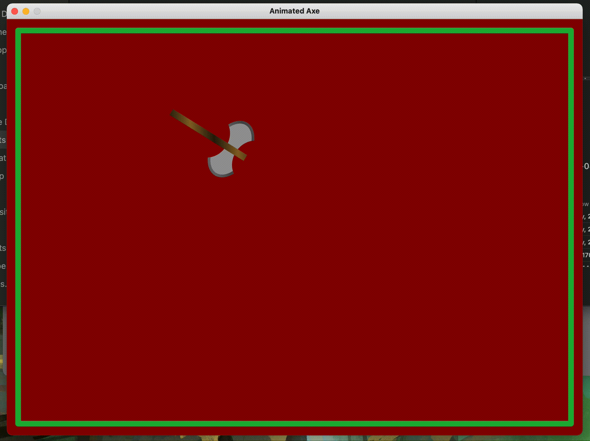

# Лаброторна робота №2
## *Пашинник Андрій КП-81*

Варіант: **№15**

Результат:

> Така мала частота кадрів (FPS) обумовлена [онлайн севрісом](https://cloudconvert.com/mov-to-gif), через який я конвертував відео у формат .gif


Код программи:
```Java
package sample;

import javax.swing.*;
import java.awt.*;
import java.awt.event.ActionEvent;
import java.awt.event.ActionListener;
import java.awt.geom.GeneralPath;

public class Main extends JPanel implements ActionListener {
    Timer timer;

    private static final int borderWidth = 10;

    private static int maxWidth;
    private static int maxHeight;

    private static final int marginWidth = 20;
    private static final int marginHeight = 20;


    private static int[][] corners = {
            {300, 150},
            {800, 500}
    };

    private int tx = corners[0][0];
    private int ty = corners[0][1];

    private int dx = 1;
    private int dy = 1;

    private final int movementVelocity = 3;
    private final double rotationVelocity = 0.05;

    private double angle = 0;


    private final GradientPaint AXE_HANDLE_GRADIENT = new GradientPaint(5, 25, new Color(133, 103, 51), 40, 2, new Color(38, 29, 13), true);
    private final GradientPaint AXE_BIT_GRADIENT = new GradientPaint(5, 25, new Color(73, 73, 73), 20, 2, new Color(107, 107, 107), true);
    private final Color AXE_CHEEK_COLOR = new Color(154, 154, 154);

    private final Color BACKGROUND_COLOR = new Color(127, 23, 14);
    private final Color LINE_COLOR = new Color(86, 177, 76);


    public Main() {
        timer = new Timer(10, this);
        timer.start();
    }

    public static void main(String[] args) {
        JFrame frame = new JFrame("Animated Axe");

        frame.setDefaultCloseOperation(JFrame.EXIT_ON_CLOSE);
        frame.setSize(1024, 768);
        frame.setResizable(false);
        frame.setLocationRelativeTo(null);
        frame.add(new Main());
        frame.setVisible(true);

        Dimension size = frame.getSize();
        Insets insets = frame.getInsets();

        maxWidth = size.width - insets.left - insets.right - 1;
        maxHeight = size.height - insets.top - insets.bottom - 1;
    }

    public void paint(Graphics g) {
        super.paint(g);
        Graphics2D g2d = (Graphics2D) g;

        g2d.setBackground(BACKGROUND_COLOR);
        g2d.clearRect(0, 0, maxWidth + 1, maxHeight + 1);

        g2d.setRenderingHint(RenderingHints.KEY_ANTIALIASING, RenderingHints.VALUE_ANTIALIAS_ON);
        g2d.setRenderingHint(RenderingHints.KEY_RENDERING, RenderingHints.VALUE_RENDER_QUALITY);

        g2d.setColor(LINE_COLOR);
        BasicStroke bs1 = new BasicStroke(borderWidth, BasicStroke.CAP_ROUND, BasicStroke.JOIN_ROUND);
        g2d.setStroke(bs1);
        g2d.drawRect(marginWidth, marginHeight, maxWidth - marginWidth * 2, maxHeight - marginHeight * 2);


        g2d.rotate(angle, tx - 20, ty + 55);

        // axe bit
        g2d.setPaint(AXE_BIT_GRADIENT);
        g2d.fillOval(tx, ty, 70, 110);

        // axe cheek
        g2d.setColor(AXE_CHEEK_COLOR);
        g2d.fillOval(tx + 5, ty + 5, 60, 100);

        //
        g2d.setColor(BACKGROUND_COLOR);
        g2d.fillOval(tx - 45, ty + 15, 70, 80);
        g2d.fillOval(tx + 45, ty + 15, 70, 80);

        // axe handle
        // TODO: refactor
        g2d.setPaint(AXE_HANDLE_GRADIENT);
        double[][] axeHandlePoints = {
                {tx - 90, ty - 6 + 55},
                {tx - 90, ty + 6 + 55},
                {tx + 65, ty + 6 + 55},
                {tx + 65, ty - 6 + 55}
        };
        GeneralPath axeHandlePath = new GeneralPath();
        axeHandlePath.moveTo(axeHandlePoints[0][0], axeHandlePoints[0][1]);
        for (int k = 1; k < axeHandlePoints.length; k++) {
            axeHandlePath.lineTo(axeHandlePoints[k][0], axeHandlePoints[k][1]);
        }
        axeHandlePath.closePath();
        g2d.fill(axeHandlePath);

    }

    public void actionPerformed(ActionEvent e) {
        if (tx <= corners[0][0] && ty <= corners[1][1]) {
            dx = 0;
            dy = movementVelocity;
        } else if (tx <= corners[1][0] && ty >= corners[1][1]) {
            dx = movementVelocity;
            dy = 0;
        } else if (tx >= corners[1][0] && ty >= corners[0][1]) {
            dx = 0;
            dy = -movementVelocity;
        } else if (tx >= corners[0][0] && ty <= corners[0][1]) {
            dx = -movementVelocity;
            dy = 0;
        }

        tx += dx;
        ty += dy;

        angle += -rotationVelocity;

        repaint();
    }

}


```
