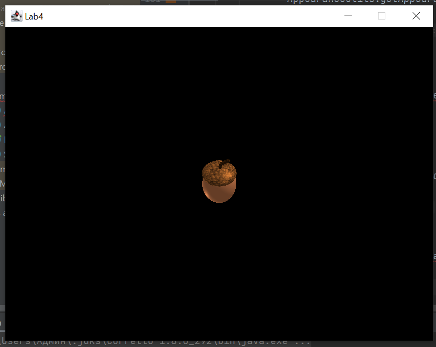
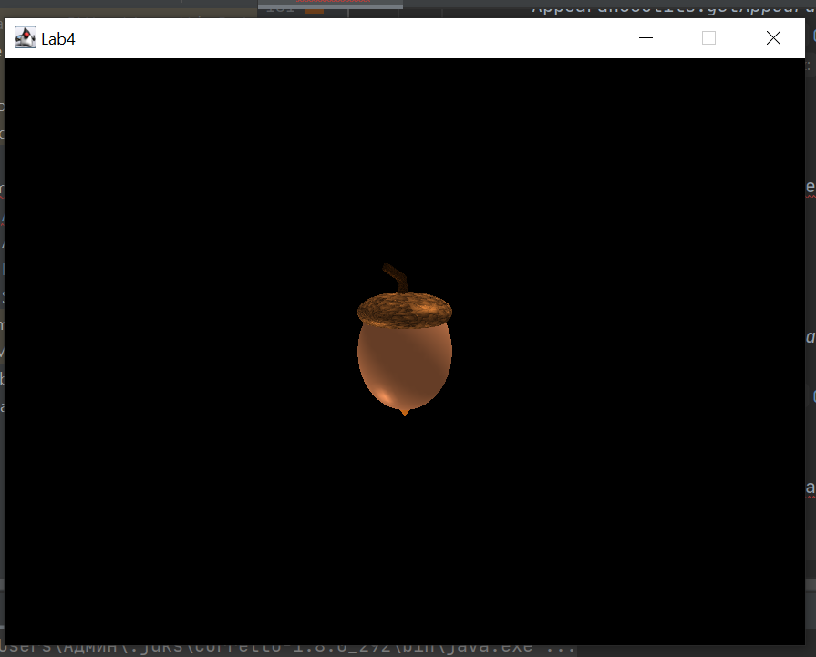
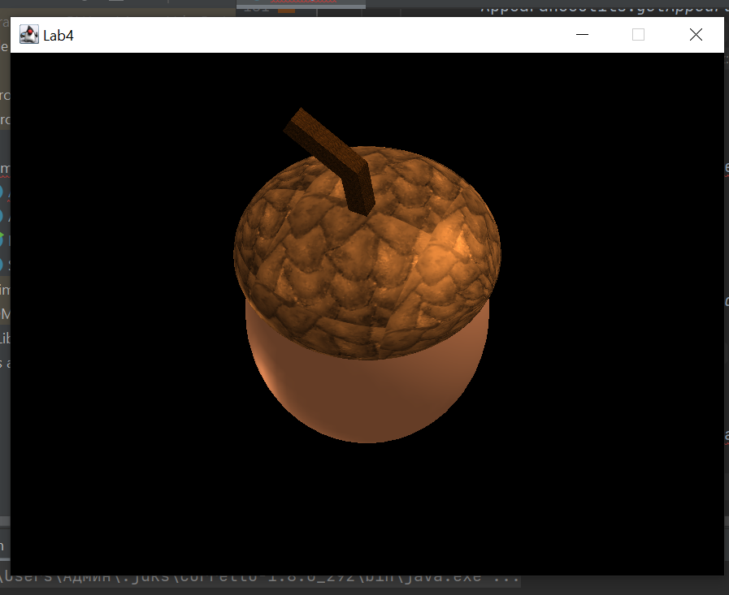

# Лаброторна робота №4
## *Пашинник Андрій КП-81*

Варіант: **№16**

Результаты роботы программи:








Код программи:
```Java
// Acorn.java
package sample;

import com.sun.j3d.utils.geometry.*;
import com.sun.j3d.utils.universe.SimpleUniverse;

import javax.media.j3d.*;
import javax.swing.*;
import javax.vecmath.Color3f;
import javax.vecmath.Point3d;
import javax.vecmath.Vector3d;
import javax.vecmath.Vector3f;
import java.awt.*;
import java.awt.event.ActionEvent;
import java.awt.event.ActionListener;
import java.awt.event.KeyAdapter;
import java.awt.event.KeyEvent;

public class Acorn extends JFrame implements ActionListener {

    private static final float UPPER_EYE_LIMIT = 15.0f; //30.0f
    private static final float LOWER_EYE_LIMIT = -15.0f; //-30.0f
    private static final float FARTHEST_EYE_LIMIT = 15.0f; //30.0f
    private static final float NEAREST_EYE_LIMIT = 2.0f; //5.0f
    private static final float DELTA_ANGLE = 0.06f;
    private static final float DELTA_DISTANCE = 1f;

    private TransformGroup acornTransformGroup;
    private final Transform3D acornTransform3D = new Transform3D();
    private TransformGroup viewingTransformGroup;
    private final Transform3D viewingTransform = new Transform3D();

    private float eyeHeight = UPPER_EYE_LIMIT;
    private float eyeDistance = FARTHEST_EYE_LIMIT;
    private float zAngle = 0;

    private DirectionalLight leftTopLight;
    private DirectionalLight rightBottomLight;
    private AmbientLight ambientLight;
    private final BoundingSphere bounds = new BoundingSphere(new Point3d(0.0, 0.0, 0.0), 100.0);

    public Acorn() {
        setTitle("Acorn");
        setDefaultCloseOperation(JFrame.EXIT_ON_CLOSE);
        setSize(900, 700);
        setResizable(false);

        initUniverse();

        Timer timer = new Timer(10, this);
        timer.start();

    }

    private void initUniverse() {

        //Create a Canvas3D using the preferred configuration
        Canvas3D canvas = new Canvas3D(SimpleUniverse.getPreferredConfiguration());
        canvas.setFocusable(true);

        canvas.addKeyListener(new KeyAdapter() {
            @Override
            public void keyPressed(KeyEvent e) {
                switch (e.getKeyCode()) {
                    case 68:
                        zAngle += DELTA_ANGLE;
                        break;
                    case 65:
                        zAngle -= DELTA_ANGLE;
                        break;
                    case KeyEvent.VK_UP:
                        if (eyeHeight < UPPER_EYE_LIMIT) {
                            eyeHeight += DELTA_DISTANCE;
                        }
                        break;
                    case KeyEvent.VK_DOWN:
                        if (eyeHeight > LOWER_EYE_LIMIT) {
                            eyeHeight -= DELTA_DISTANCE;
                        }
                        break;
                    case 87:
                        if (eyeDistance > NEAREST_EYE_LIMIT) {
                            eyeDistance -= DELTA_DISTANCE;
                        }
                        break;
                    case 83:
                        if (eyeDistance < FARTHEST_EYE_LIMIT) {
                            eyeDistance += DELTA_DISTANCE;
                        }
                        break;
                    default:
                        break;

                }
            }
        });

        //Add the canvas into the center of the screen
        add(canvas, BorderLayout.CENTER);

        //Create a Simple Universe with view branch
        SimpleUniverse universe = new SimpleUniverse(canvas);

        //Add the branch into the Universe
        universe.addBranchGraph(createSceneGraph());
        viewingTransformGroup = universe.getViewingPlatform().getViewPlatformTransform();
    }

    private BranchGroup createSceneGraph() {

        //Create the root of the branch graph
        BranchGroup objRoot = new BranchGroup();

        //Create a new Transform group
        acornTransformGroup = new TransformGroup();
        //Allows the cube to the rotated
        acornTransformGroup.setCapability(TransformGroup.ALLOW_TRANSFORM_WRITE);

        buildAcorn();

        TransformGroup tg = new TransformGroup();
        Transform3D t = new Transform3D();
        t.setScale(new Vector3d(0.5f, 0.5f, 0.5f));
        tg.setTransform(t);
        tg.addChild(acornTransformGroup);

        //Add the transform group to the BranchGroup
        objRoot.addChild(tg);

        addLights(objRoot);

        return objRoot;
    }

    private void addLights(BranchGroup objRoot) {
        Color3f lightColor1 = new Color3f(1.0f, 1.0f, 1.0f);
        Vector3f lightDirection1 = new Vector3f(4.0f, -7.0f, -12.0f);
        leftTopLight = new DirectionalLight(lightColor1, lightDirection1);
        leftTopLight.setCapability(DirectionalLight.ALLOW_INFLUENCING_BOUNDS_WRITE);
        leftTopLight.setInfluencingBounds(bounds);
        objRoot.addChild(leftTopLight);

        Color3f lightColor2 = new Color3f(1f, 1f, 1f);
        Vector3f lightDirection2 = new Vector3f(4.0f, 7.0f, 12.0f);
        rightBottomLight = new DirectionalLight(lightColor2, lightDirection2);
        rightBottomLight.setCapability(DirectionalLight.ALLOW_INFLUENCING_BOUNDS_WRITE);
        rightBottomLight.setInfluencingBounds(bounds);
        objRoot.addChild(rightBottomLight);

        Color3f ambientColor = new Color3f(1.0f, 1.0f, 1.0f);
        ambientLight = new AmbientLight(ambientColor);
        ambientLight.setCapability(AmbientLight.ALLOW_INFLUENCING_BOUNDS_WRITE);
        ambientLight.setInfluencingBounds(bounds);
        objRoot.addChild(ambientLight);
    }

    private void buildAcorn() {
        ShapeTransform shapeTransform = new ShapeTransform();
        int primFlags = Primitive.GENERATE_NORMALS + Primitive.GENERATE_TEXTURE_COORDS;

        TransformGroup body = shapeTransform.setShape(new Sphere(
                0.7f,
                primFlags,
                60,
                AppearanceUtils.getAppearance(new Color(185, 86, 3), null)))
                .setScale(2f, 2f, 2.5f)
                .getTransformGroup();

        TransformGroup lowerPeak = shapeTransform.setShape(new Cone(
                1.35f,
                2f,
                primFlags,
                AppearanceUtils.getAppearance(new Color(125, 65, 15), null)))
                .rotX(-90)
                .setTranslation(0f, 0f, -1f)
                .getTransformGroup();

        TransformGroup hat = shapeTransform.setShape(new Sphere(
                0.7f,
                primFlags,
                60,
                AppearanceUtils.getAppearance(new Color(111, 65, 28), "resource\\images\\bg1.png")))
                .setTranslation(0f, 0f, 1.2f)
                .setScale(2f, 2f, 0.8f)
                .getTransformGroup();

        // TODO: fix namespaces like com.sun.j3d.utils.geometry.Box
        TransformGroup hatStickFirst = shapeTransform.setShape(new com.sun.j3d.utils.geometry.Box(
                0.1f,
                0.1f,
                0.27f,
                primFlags,
                AppearanceUtils.getAppearance(new Color(50, 25, 5), "resource\\images\\bg1.png")))
                .rotX(-10)
                .setTranslation(0f, 0.1f, 2f)
                .getTransformGroup();

        TransformGroup hatStickLast = shapeTransform.setShape(new com.sun.j3d.utils.geometry.Box(
                0.1f,
                0.1f,
                0.4f,
                primFlags,
                AppearanceUtils.getAppearance(new Color(50, 25, 5), "resource\\images\\bg1.png")))
                .rotX(-60)
                .setTranslation(0, 0.45f, 2.4f)
                .getTransformGroup();

        acornTransformGroup.addChild(body);
        acornTransformGroup.addChild(lowerPeak);
        acornTransformGroup.addChild(hat);
        acornTransformGroup.addChild(hatStickFirst);
        acornTransformGroup.addChild(hatStickLast);

    }

    @Override
    public void actionPerformed(ActionEvent e) {
        acornTransform3D.rotZ(zAngle);
        acornTransformGroup.setTransform(acornTransform3D);

        Point3d eye = new Point3d(eyeDistance, .0f, eyeHeight); // spectator's eye
        Point3d center = new Point3d(.0f, .0f, .0f); // sight target
        Vector3d up = new Vector3d(.0f, .0f, 1.0f);

        // the camera frustum
        viewingTransform.lookAt(eye, center, up);
        viewingTransform.invert();
        viewingTransformGroup.setTransform(viewingTransform);
    }
}
```

```Java
// AppearanceUtils.java.java
package sample;

import com.sun.j3d.utils.image.TextureLoader;

import javax.media.j3d.Appearance;
import javax.media.j3d.Material;
import javax.media.j3d.Texture;
import javax.media.j3d.TextureAttributes;
import javax.vecmath.Color3f;
import javax.vecmath.Color4f;
import java.awt.*;

public class AppearanceUtils {
    public static Appearance getAppearance(Color color, String texturePath) {
        Appearance ap = new Appearance();

        Color3f emissive = new Color3f(Color.BLACK);
        Color3f ambient = new Color3f(color);
        Color3f diffuse = new Color3f(color);
        Color3f specular = new Color3f(color);

        ap.setMaterial(new Material(ambient, emissive, diffuse, specular, 64.0f));

        if (texturePath != null && !texturePath.isEmpty()) {
            TextureLoader loader = new TextureLoader(texturePath, "LUMINANCE", new Container());
            Texture texture = loader.getTexture();

            texture.setBoundaryModeS(Texture.WRAP);
            texture.setBoundaryModeT(Texture.WRAP);
            texture.setBoundaryColor(new Color4f(0.0f, 1.0f, 1.0f, 0.0f));
            TextureAttributes texAttr = new TextureAttributes();
            texAttr.setTextureMode(TextureAttributes.MODULATE);
            ap.setTexture(texture);
            ap.setTextureAttributes(texAttr);
        }

        return ap;

    }
}
```


```Java
// ShapeTransform.java
package sample;

import com.sun.j3d.utils.geometry.Primitive;

import javax.media.j3d.Transform3D;
import javax.media.j3d.TransformGroup;
import javax.vecmath.Vector3d;
import javax.vecmath.Vector3f;

public class ShapeTransform {
    private Primitive shape;

    private Transform3D transform3D;
    private TransformGroup transformGroup;

    public ShapeTransform() {
        init();
    }

    public ShapeTransform setShape(Primitive shape) {
        if (shape == null) {
            throw new NullPointerException("Shape can`t be NULL!");
        }
        this.shape = shape;
        return this;
    }

    public ShapeTransform setTranslation(float x, float y, float z) {
        transform3D.setTranslation(new Vector3f(x, y, z));
        return this;
    }

    public ShapeTransform rotX(float degrees) {
        transform3D.rotX(degreesToRadian(degrees));
        return this;
    }

    public ShapeTransform rotY(float degrees) {
        transform3D.rotY(degreesToRadian(degrees));
        return this;
    }

    public ShapeTransform rotZ(float degrees) {
        transform3D.rotZ(degreesToRadian(degrees));
        return this;
    }

    public ShapeTransform setScale(double x, double y, double z) {
        transform3D.setScale(new Vector3d(x, y, z));
        return this;
    }

    public TransformGroup getTransformGroup() {
        if (shape == null) {
            throw new IllegalStateException("The shape has not yet been generated!");
        }
        transformGroup.setTransform(transform3D);
        transformGroup.addChild(shape);

        TransformGroup transformGroupToReturn = transformGroup;

        init();

        return transformGroupToReturn;
    }

    private double degreesToRadian(float degrees) {
        return degrees * Math.PI / 180.0;
    }

    private void init() {
        shape = null;
        transformGroup = new TransformGroup();
        transform3D = new Transform3D();
    }
}
```
