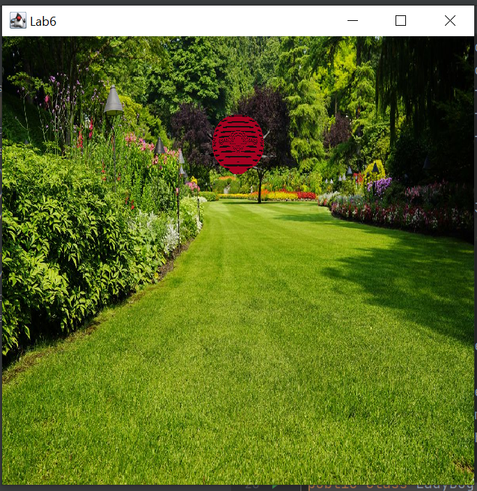
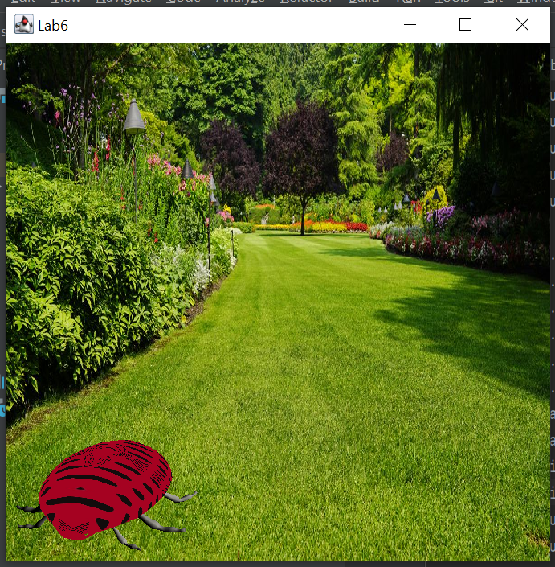

# Лаброторна робота №6
## *Пашинник Андрій КП-81*

Варіант: **№16**

Результаты роботы программи:







Код программи:
```Java
// LadyBug.java

import com.sun.j3d.loaders.Scene;
import com.sun.j3d.loaders.objectfile.ObjectFile;
import com.sun.j3d.utils.behaviors.vp.OrbitBehavior;
import com.sun.j3d.utils.image.TextureLoader;
import com.sun.j3d.utils.universe.SimpleUniverse;

import javax.imageio.ImageIO;
import javax.media.j3d.*;
import javax.swing.*;
import javax.vecmath.Color3f;
import javax.vecmath.Point3d;
import javax.vecmath.Vector3f;
import java.awt.*;
import java.awt.image.BufferedImage;
import java.io.File;
import java.io.IOException;
import java.util.Enumeration;
import java.util.Hashtable;

public class LadyBug extends JFrame {
    private final Canvas3D canvas;
    private Hashtable roachNamedObjects;

    public LadyBug() {
        this.setDefaultCloseOperation(JFrame.EXIT_ON_CLOSE);
        canvas = new Canvas3D(SimpleUniverse.getPreferredConfiguration());
        SimpleUniverse simpUniv = new SimpleUniverse(canvas);
        simpUniv.getViewingPlatform().setNominalViewingTransform();
        createSceneGraph(simpUniv);
        addLight(simpUniv);

        //наступні рядки дозволяють навігацію по сцені за допомогою миші
        OrbitBehavior ob = new OrbitBehavior(canvas);
        ob.setSchedulingBounds(new BoundingSphere(new Point3d(0.0, 0.0, 0.0), Double.MAX_VALUE));
        simpUniv.getViewingPlatform().setViewPlatformBehavior(ob);


        setTitle("Lab6");
        setSize(700, 700);
        getContentPane().add("Center", canvas);
        setVisible(true);
    }

    public static void main(String[] args) {
        new LadyBug();
    }

    private void createSceneGraph(SimpleUniverse su) {
        ObjectFile f = new ObjectFile(ObjectFile.RESIZE);
        Scene bugScene = null;
        try {
            bugScene = f.load("models/ladybug.obj");
        } catch (Exception e) {
            System.out.println("File loading failed:" + e);
        }

        Transform3D scaling = new Transform3D();
        scaling.setScale(1.0 / 6);

        Transform3D tfBug = new Transform3D();
        tfBug.rotX(-3 * Math.PI / 2);
        tfBug.mul(scaling);
        TransformGroup tgBug = new TransformGroup(tfBug);

        TransformGroup sceneGroup = new TransformGroup();

        //та вивід в консоль назв об'єктів
        roachNamedObjects = bugScene.getNamedObjects();
        Enumeration enumer = roachNamedObjects.keys();
        String name;
        while (enumer.hasMoreElements()) {
            name = (String) enumer.nextElement();
            System.out.println("Name: " + name);
        }

        BranchGroup scene = new BranchGroup();

        TransformGroup tgBody = new TransformGroup();
        Shape3D body_bug = (Shape3D) roachNamedObjects.get("ladybug");
        body_bug.setAppearance(loadTexture("resources/ladybug-pattern.jpg", true));
        tgBody.addChild(body_bug.cloneTree());


        int noRotHour = 1000; //кількість обертів
        int timeRotationHour = 500;//час одного оберту

        BoundingSphere bs = new BoundingSphere(new Point3d(0.0, 0.0, 0.0), Double.MAX_VALUE);

        Transform3D legRotAxis = new Transform3D();
        legRotAxis.rotZ(Math.PI / 2);
        Transform3D leg2RotAxis = new Transform3D();

        sceneGroup.addChild(getAnimatedLeg("leg1", noRotHour, timeRotationHour, legRotAxis, bs, (float) Math.PI / 8, 100));
        sceneGroup.addChild(getAnimatedLeg("leg2", noRotHour, timeRotationHour, legRotAxis, bs, (float) Math.PI / 8, 200));
        sceneGroup.addChild(getAnimatedLeg("leg3", noRotHour, timeRotationHour, legRotAxis, bs, (float) Math.PI / 8, 300));

        sceneGroup.addChild(getAnimatedLeg("leg4", noRotHour, timeRotationHour, leg2RotAxis, bs, -(float) Math.PI / 8, 100));
        sceneGroup.addChild(getAnimatedLeg("leg5", noRotHour, timeRotationHour, leg2RotAxis, bs, -(float) Math.PI / 8, 200));
        sceneGroup.addChild(getAnimatedLeg("leg6", noRotHour, timeRotationHour, leg2RotAxis, bs, -(float) Math.PI / 8, 300));

        sceneGroup.addChild(tgBody.cloneTree());


        Transform3D tCrawl = new Transform3D();
        tCrawl.rotY(-Math.PI / 2);

        long crawlTime = 30000;
        Alpha crawlAlpha = new Alpha(1, Alpha.INCREASING_ENABLE, 0, 0, crawlTime, 0, 0, 0, 0, 0);

        float crawlDistance = 8.0f; //відстань, на яку просунеться об’єкт
        PositionInterpolator posICrawl = new PositionInterpolator(crawlAlpha, sceneGroup, tCrawl, -8.0f, crawlDistance);

        posICrawl.setSchedulingBounds(bs);
        sceneGroup.setCapability(TransformGroup.ALLOW_TRANSFORM_WRITE);
        sceneGroup.addChild(posICrawl);

        tgBug.addChild(sceneGroup);
        scene.addChild(tgBug);

        //створюємо фон
        addImageBackground("resources/grow-grass.jpg", scene);
        scene.compile();

        //додаємо сцену до віртуального всесвіту
        su.addBranchGraph(scene);
    }

    private void addImageBackground(String imagePath, BranchGroup root) {
        TextureLoader t = new TextureLoader(imagePath, canvas);
        Background background = new Background(t.getImage());
        background.setImageScaleMode(Background.SCALE_FIT_ALL);
        BoundingSphere bounds = new BoundingSphere(new Point3d(0.0, 0.0, 0.0), 100.0);
        background.setApplicationBounds(bounds);
        root.addChild(background);
    }

    private TransformGroup getAnimatedLeg(String elementName, int noRotHour, long timeRotationHour, Transform3D legRotAxis, Bounds bs, float v, int l) {
        Alpha legRotAlpha = new Alpha(noRotHour, Alpha.INCREASING_ENABLE, l, 0, timeRotationHour,
                0, 0, 0, 0, 0);

        Shape3D leg = (Shape3D) roachNamedObjects.get(elementName);
        TransformGroup tgLeg = new TransformGroup();
        tgLeg.addChild(leg.cloneTree());

        RotationInterpolator legRotation = new RotationInterpolator(legRotAlpha, tgLeg, legRotAxis, v, 0.0f);
        legRotation.setSchedulingBounds(bs);
        tgLeg.setCapability(TransformGroup.ALLOW_TRANSFORM_WRITE);
        tgLeg.addChild(legRotation);
        return tgLeg;
    }

    private void addLight(SimpleUniverse su) {
        BranchGroup bgLight = new BranchGroup();
        BoundingSphere bounds = new BoundingSphere(new Point3d(0.0, 0.0, 0.0), 100.0);
        Color3f lightColour = new Color3f(1.0f, 1.0f, 1.0f);
        Vector3f lightDir = new Vector3f(-1.0f, 0.0f, -0.5f);
        DirectionalLight light = new DirectionalLight(lightColour, lightDir);
        light.setInfluencingBounds(bounds);
        bgLight.addChild(light);
        su.addBranchGraph(bgLight);
    }

    private Image loadImage(String fileName) {
        BufferedImage img = null;
        try {
            img = ImageIO.read(new File(fileName));
        } catch (IOException e) {
            System.out.println(e.getMessage());
        }
        return img;
    }

    private Appearance loadTexture(String fileName, boolean emit) {
        Appearance app = new Appearance();

        TextureLoader loader = new TextureLoader(loadImage(fileName), null);
        Texture2D texture = (Texture2D) loader.getTexture();
        texture.setMinFilter(Texture.BASE_LEVEL_LINEAR);
        texture.setMagFilter(Texture.BASE_LEVEL_LINEAR);

        TextureAttributes texAttr = new TextureAttributes();
        texAttr.setTextureMode(TextureAttributes.MODULATE);
        app.setTextureAttributes(texAttr);

        app.setTexture(texture);

        Color3f white = new Color3f(1.0f, 1.0f, 1.0f);
        Color3f black = new Color3f(0f, 0f, 0f);
        if (emit)
            app.setMaterial(new Material(black, white, black, black, 4.0f));
        else
            app.setMaterial(new Material(white, black, white, white, 4.0f));

        return app;
    }
}

```
